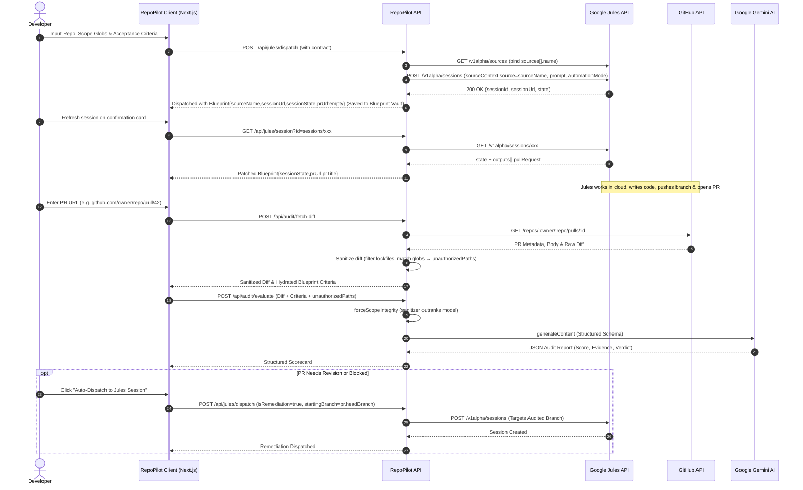

# RepoPilot Architecture & Engineering Specification

## 1. Architectural Philosophy: The Decoupled Imperative

Traditional agentic development tools suffer from a fatal flaw: **synchronous connection coupling**.
When an agent attempts to edit files live over an active WebSocket or SSE stream:
- **Network instability** causes dropped state and half-written files.
- **Latency constraints** force models to make hasty decisions without full-repository context.
- **Scope drift** goes unchecked because human reviewers are presented with sprawling, multi-file diffs without an explicit mathematical contract.

RepoPilot implements a **State-Hydrated Decoupled Lifecycle**:

```
[ Developer Formulation ] ---> [ Anti-Drift Compiler ] ---> [ Jules Cloud Session (Async) ]
                                                                      |
                                                                      v
[ 1-Click Remediation ] <--- [ Gemini Structured Audit ] <--- [ GitHub Pull Request ]
```

---

## 2. Component Taxonomy

### 2.1 Stage 1: Intake & Dispatch (`IntakeDispatchStage.tsx`)
- **Responsibility:** Captures developer intent, target repository, starting/target branches, file boundaries, and acceptance criteria.
- **State Serialization:** Compiles requirements into a standard markdown contract embedded with a machine-readable blueprint comment:
  ```html
  <!-- AUDIT_BLUEPRINT
  {
    "blueprintId": "bp_1710123456",
    "repo": "acme-corp/api-gateway",
    "criteria": [...]
  }
  -->
  ```
- **Dispatch Engine (`/api/jules/dispatch`):** Binds `owner/repo` to a real `sources[].name` via `GET /v1alpha/sources` (fail-closed 404 `Source not connected in Jules`, never invents `sources/github/...`). First-pass requests `AUTO_CREATE_PR`; remediation omits `automationMode` with `startingBranch=headBranch`. Returns `Blueprint{sourceName,sessionUrl,sessionState}` with honest empty `prUrl`; poll via `GET /api/jules/session?id=`. Supports a fallback dry-run mode that generates local blueprints for offline testing.

### 2.2 Stage 2: Audit & Remediation (`AuditEvaluationStage.tsx` & `MergeScorecard.tsx`)
- **Responsibility:** Evaluates candidate pull requests against the original contract.
- **State Hydration:**
  - *Primary mechanism:* Extracts `<!-- AUDIT_BLUEPRINT -->` comment directly from the PR body via GitHub API.
  - *Fallback mechanism:* Hydrates criteria from the user's local Blueprint Vault (`localStorage`).
  - *Manual mechanism:* Allows developers to add or adjust criteria directly in the UI.
- **Diff Sanitizer (`lib/diff-sanitizer.ts`):**
  - Identifies out-of-scope files using glob regex conversion supporting recursive wildcards (`**`).
  - Strips lockfiles (`package-lock.json`, `pnpm-lock.yaml`, `yarn.lock`, etc.) to conserve token budget.
  - Parses git diff hunks and calculates total additions/deletions.
- **Gemini Structured Audit (`/api/audit/evaluate` — server single truth):**
  - Sends the sanitized diff (shared 90k-char budget with per-file reserve, `truncated` flagged), acceptance criteria, and unioned `unauthorizedPaths` to Google Gemini.
  - `forceScopeIntegrity` lets the sanitizer outrank the model: any flagged path forces `strictlyInScope=false` (empty = clean, omitted = unverified; `unionUnauthorizedPaths()` is add-only).
  - `attachAuditGrade()` then stamps Stage 1 categories by normalized id, validates `path:lines` refs against sanitizer `touchedPaths` (`unverifiedReferences` = “cited, not in diff”), builds `AuditGrade`, and syncs `mergeVerdict` from the grade. UI renders `report.grade`.
  - Returns schema-validated JSON with:
    - Per-criterion verdicts (`MET`, `PARTIALLY_MET`, `UNMET`) plus `satisfiedAspects` (what holds) / `remainingWork` (concrete gap) and validated line-number references.
    - Scope integrity assessment and unauthorized files list with flat −35 penalty (`criteria − scope = total`).
    - Severity-grounded change risk (`LOW` ≤149 lines, `MEDIUM` 150–500 or non-critical scope drift, `HIGH` >500 or critical files: `package.json`/lockfiles/`Dockerfile`/`.env`/configs/migrations/`auth`/`security`).
    - Merge readiness score (0-100), `why[≤3]` reasons, `nextDecision` (`merge`/`revert_scope`/`remediate`/`blocked`), category rollup (`functional`/`security`/`testing`/`constraint`), and definitive verdict (`READY_TO_MERGE`, `NEEDS_REVISION`, `BLOCKED`).
- **Autonomous Remediation Loop:**
  - When a PR requires revision, the scorecard compiles an actionable markdown prompt embedding:
    - Crucial branch checkout directive (`startingBranch: pr.headBranch`).
    - Specific file revert instructions for out-of-scope modifications.
    - Concrete line-by-line evidence of missing criteria.
  - Provides a 1-click **"Auto-Dispatch to Jules Session"** button that dispatches a new Jules session targeting the audited branch directly.

---

## 3. Sequence Flow Diagram



---

## 4. Anti-Drift Mathematics & Glob Conversion

To guarantee agent adherence to file boundaries, path matching must satisfy strict POSIX and globbing invariants:

1. **Exact subpath matching:** A path `src/middleware/auth.ts` matches `src/middleware/**`.
2. **Recursive wildcards (`**`):**
   - Matches zero or more path segments.
   - Converted to `(?:/|/.+/)` or `.*` without allowing unintended escaping.
3. **Single wildcards (`*`):**
   - Matches characters strictly within a single directory segment: `[^/]*`.
4. **Boundary Penalty Calculation:**
    - Any modification to a file outside the declared boundary globs incurs a deterministic 35-point deduction via `computeScorecardMetrics` (sole headline-math owner; `buildAuditGrade()` derives from it; `forceScopeIntegrity` outranks the model verdict). Scorecard prints `criteria − scope = total`.
5. **Change-Risk Severity:**
    - Critical unauthorized paths (manifests, lockfiles, containers, secrets, build configs, migrations, auth/security) force `HIGH`. Non-critical drift (e.g. lone `README.md`) softens to `MEDIUM` — merge-blocking is preserved via `revert_scope` + `−35` + never-`READY`, even when risk is not `HIGH`.
6. **Next-Decision Mapping:**
    - `READY_TO_MERGE` → `merge`; unauthorized >0 → `revert_scope`; `BLOCKED` → `blocked`; else `remediate`. Rendered as `Next: <sentence> <branch>` with `Why this grade[≤3]` above it.

---

## 5. Security & Threat Model

| Vector | Risk | Mitigation |
| :--- | :--- | :--- |
| **API Key Leakage** | Sensitive keys exposed in browser bundle | API keys are kept server-side in `.env.local` or passed via transient request headers from client `localStorage`. No keys are written to client bundles or persistent logs. |
| **Prompt Injection via PR** | Malicious comments in PR modifying evaluation behavior | Prompt inputs are demarcated using strict markdown boundaries and evaluated against a rigid JSON schema where all outputs must map to predetermined enums (`MET`, `PARTIALLY_MET`, `UNMET`). |
| **Denial of Service via Giant Diffs** | Giant diffs blowing out memory or token context | `diff-sanitizer.ts` caps max diff size to 120,000 characters, automatically eliding lockfiles, binary artifacts, and minified bundles. |
| **Rogue Branch Spawning** | Remediation creating duplicate PRs or branch conflicts | Remediation payload strictly enforces `startingBranch: prMetadata.headBranch` to ensure Jules works on the audited branch. |

---

## 6. After 1.0.1

1.0.1 freezes the current loop: dispatch → wait for PR → audit → same-branch fix. Later, not in this release:

1. **GitHub Action Integration:** Package the audit engine into a standalone reusable GitHub Action (`repopilot-audit-action`) for automated CI/CD gating.
2. **Multi-Agent Comparative Audit:** Dispatch parallel sessions to multiple models (e.g. Jules, Claude Code, GitHub Copilot Workspace) and perform automated multi-way diff arbitration.
3. **Automated PR Merge Trigger:** Automatically trigger `gh pr merge` when the Merge Readiness Scorecard reaches 95+ and CI status checks pass.
